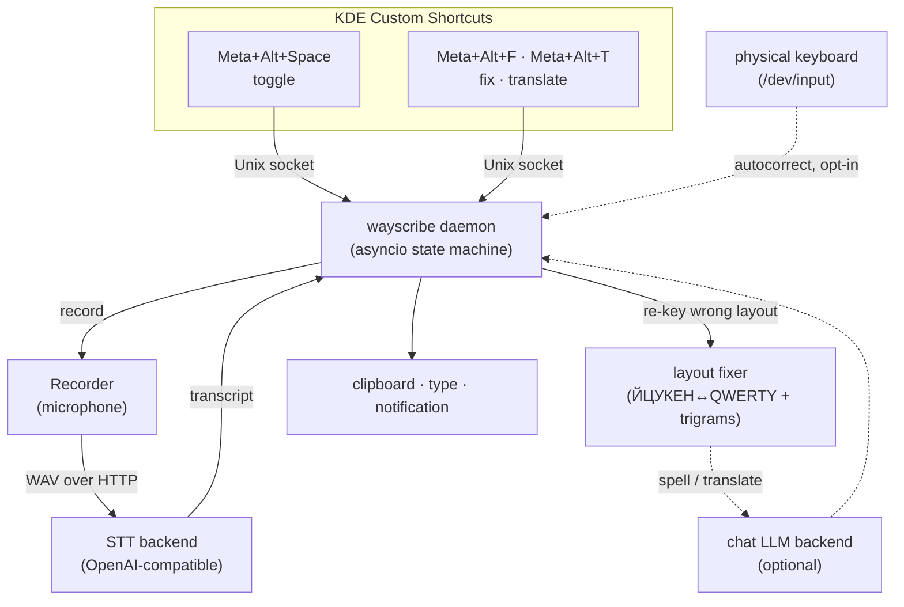

# wayscribe — hotkey voice-to-text & layout fixer for KDE Plasma Wayland

Press a global hotkey, speak, press it again — your words land in the clipboard,
optionally typed straight into the focused window, always with a KDE
notification preview. wayscribe also **fixes text typed in the wrong keyboard
layout** (`ghbdtn` → `привет`) and can **spell-fix or translate** a selection
through a local LLM. Headless: no GUI windows, just a background daemon and a
couple of hotkeys.

**Targeted at KDE Plasma on Wayland**: input/output is Wayland-native
(`wl-copy`, `ydotool`/`wtype`, `notify-send`, KDE D-Bus). Transcription and the
optional LLM features run in **separate local backends** that wayscribe only
talks to over plain HTTP — any OpenAI-compatible speech-to-text or chat server
works, on whatever hardware you have. The reference STT setup runs Whisper V3
Turbo on an **AMD Ryzen AI NPU**, but that is just one option.

> **Install, configure, troubleshoot → [SETUP.md](SETUP.md).**
> Transcription/LLM backends → **[BACKEND.md](BACKEND.md)**.
> Building from source, packaging, hacking on the code → **[DEVELOPMENT.md](DEVELOPMENT.md)**.

## How it works



1. The hotkey runs a thin client (`wayscribe toggle`) that sends one command to
   the long-lived **daemon** over a Unix socket — so the response is instant.
2. First toggle starts recording the mic; second toggle stops and POSTs the WAV
   to the **transcription backend** (any OpenAI-compatible STT).
3. The transcript fans out to your configured outputs: clipboard (`wl-copy`),
   keystroke injection (`ydotool`; `wtype` on wlroots), and a KDE notification.

The daemon holds a small state machine (`IDLE → RECORDING → TRANSCRIBING →
IDLE`). Safety rails: a max-duration watchdog auto-stops a forgotten recording,
and an opt-in silence detector can stop recording for you after you stop
talking.

Beyond dictation, the same daemon powers the **layout fixer** (`wayscribe fix` —
re-keys wrong-layout text via a static ЙЦУКЕН↔QWERTY map + trigram detection)
and, when a local LLM endpoint is configured, **spell-fix and translate** on the
current selection. An opt-in, keylogger-class **global autocorrect** can also fix
wrong-layout words live as you type. See [SETUP.md](SETUP.md) for the config.

## Usage

Press the hotkey, speak, press it again. The transcript goes to your clipboard
and a notification shows a preview. Paste with `Ctrl+V`. With `auto_type` on, it
types itself into whatever window has focus — no paste needed.

| Command | What it does |
| --- | --- |
| `wayscribe toggle` | Start recording if idle; stop and transcribe if recording. |
| `wayscribe status` | Print the daemon state + backend reachability as JSON. |
| `wayscribe doctor` | Diagnose daemon, backend, output tools, and config. |
| `wayscribe cancel` | Discard the current recording without transcribing. |
| `wayscribe stop` | Tell the daemon to exit cleanly. |
| `wayscribe oneshot --duration 5` | Record N seconds and print the transcript (no daemon). |
| `wayscribe lang` | Show the current transcription language. |
| `wayscribe lang next` | Cycle to the next language in `languages`. |
| `wayscribe lang ru` / `en` / `auto` | Set the language; `auto` lets Whisper detect it. |
| `wayscribe fix` | Fix wrong-layout text in the selection (`ghbdtn` → `привет`). |
| `wayscribe fix --spell` | Also LLM-correct spelling/grammar after re-keying (needs `llm_endpoint`). |
| `wayscribe translate` | Translate the selection to English (needs `llm_endpoint`). |
| `wayscribe autocorrect [on\|off\|toggle]` | Toggle global auto-layout-fix as you type (needs `evdev_autocorrect = true`). |
| `wayscribe log [-f] [-n N]` | Tail the daemon journal (systemd `--user` unit). |

Quick smoke test once everything is up:

```bash
wayscribe doctor              # checklist: daemon / backend / tools / config
wayscribe status              # {"ok": true, "state": "idle", "backend": "up", ...}
wayscribe oneshot --duration 3   # speak for 3 s, see the transcript printed
```

## License

See [LICENSE](LICENSE).
