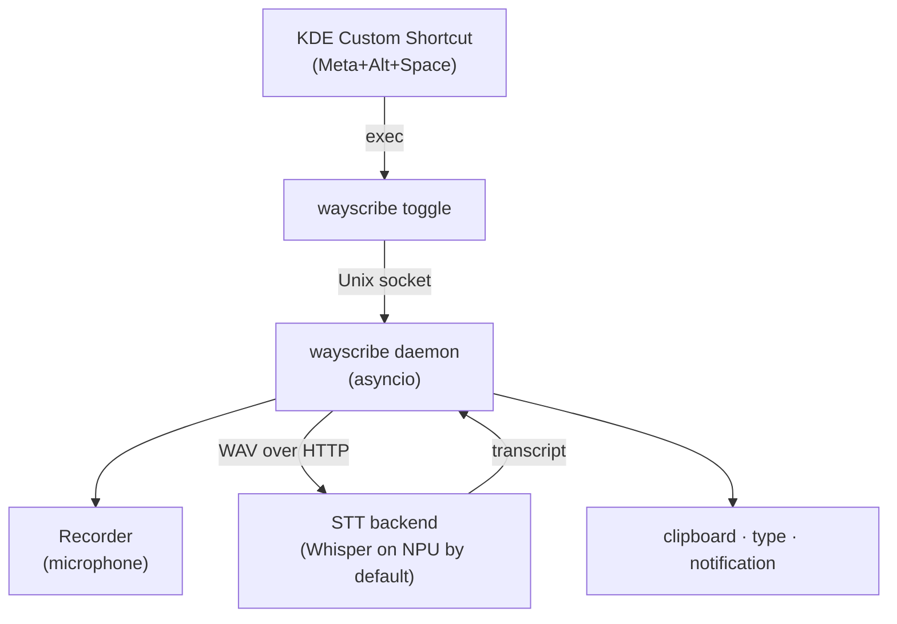

# wayscribe — hotkey voice-to-text for KDE Plasma Wayland

Press a global hotkey, speak, press it again. Your audio is transcribed by
**Whisper V3 Turbo** running on the **AMD Ryzen AI NPU**, and the text lands in
your clipboard — optionally typed straight into the focused window, always with
a KDE notification preview. Headless: no GUI windows, just a background daemon
and a couple of hotkeys.

**Targeted at KDE Plasma on Wayland**: input/output is Wayland-native
(`wl-copy`, `wtype`, `notify-send`, KDE D-Bus). The transcription itself runs in
a separate backend — built for the AMD Ryzen AI NPU, but the app only speaks
plain HTTP, so any OpenAI-compatible speech-to-text server works. Backend setup,
the NPU stack, and alternatives all live in **[BACKEND.md](BACKEND.md)**.

> Building from source, packaging, or hacking on the code? See
> **[DEVELOPMENT.md](DEVELOPMENT.md)**. This README is for installing and using
> the app.

## How it works



1. The hotkey runs `wayscribe toggle`, a thin client that sends one command to
   the long-lived **daemon** over a Unix socket — so the response is instant.
2. First toggle starts recording the mic; second toggle stops and POSTs the WAV
   to the **[transcription backend](BACKEND.md)** (Whisper on the NPU by default).
3. The transcript fans out to your configured outputs: clipboard (`wl-copy`),
   keystroke injection (`ydotool`; `wtype` on wlroots), and a KDE notification.

The daemon holds a small state machine (`IDLE → RECORDING → TRANSCRIBING →
IDLE`). Safety rails: a max-duration watchdog auto-stops a forgotten recording,
and an opt-in silence detector can stop recording for you after you stop
talking.

## Requirements

- **KDE Plasma on Wayland.** Packaged as an openSUSE RPM.
- **A transcription backend** reachable over HTTP — the FLM container running
  Whisper on the NPU, or any OpenAI-compatible STT. See [BACKEND.md](BACKEND.md).
- **Runtime dependencies** (the RPM pulls these in):

| Package | Role | Required? |
| --- | --- | --- |
| `libportaudio2` | microphone capture | **yes** |
| `wl-clipboard` | copy transcript (`wl-copy`) | recommended |
| `libnotify-tools` | KDE notification (`notify-send`) | recommended |
| `ydotool` | type into focused window (`auto_type`) on KWin/Plasma | optional |
| `wtype` | type into focused window — **wlroots only** (Sway/Hyprland), **not KWin** | optional |

## Installation

### 1. System dependencies

```bash
sudo zypper install libportaudio2 wl-clipboard libnotify-tools
# optional, for keystroke auto-insert into the focused window (KWin/Plasma):
sudo zypper install ydotool
# (wtype is an alternative, but works only on wlroots compositors — not KWin)
```

`notify-send` is normally already present on KDE.

### 2. Install the package

Download the latest RPM from the
[releases page](https://github.com/vlad4run/wayscribe/releases/latest), then:

```bash
sudo zypper install ./wayscribe-*.rpm
```

Or grab and install it in one go with `gh`:

```bash
gh release download --repo vlad4run/wayscribe --pattern '*.rpm'
sudo zypper install ./wayscribe-*.rpm
```

This installs `/usr/bin/wayscribe`, a systemd **user** unit, and a commented
config template at
`/usr/share/doc/packages/wayscribe/config.example.toml`.

> The unit ships **disabled** — installing the RPM does not start the daemon.
> Enable it in step 4 below. It runs as a *user* service (no `sudo`), so it
> starts with your KDE login session and stops when you log out.

### 3. Start a transcription backend

wayscribe needs an OpenAI-compatible STT server listening on `endpoint`
(default `http://localhost:52625`). The reference backend is Whisper on the AMD
Ryzen AI NPU via the FLM container — **see [BACKEND.md](BACKEND.md)** for the
docker/compose setup and for using a different STT server.

### 4. Enable the daemon

```bash
systemctl --user enable --now wayscribe
```

Verify it came up:

```bash
systemctl --user status wayscribe   # should read "active (running)"
wayscribe status                    # prints {"state": "idle", ...}
```

### 5. Bind hotkeys

In **System Settings → Shortcuts → Custom Shortcuts**, add commands and bind:

- `Meta+Alt+Space` → `wayscribe toggle` *(start/stop recording)*
- `Meta+Alt+L` → `wayscribe lang next` *(cycle language; optional)*

> `Meta+Space` is Krunner — that's why the default is `Meta+Alt+Space`.

## Usage

Press the hotkey, speak, press it again. The transcript goes to your clipboard
and a notification shows a preview. Paste with `Ctrl+V`. With `auto_type` on, it
types itself into whatever window has focus — no paste needed.

| Command | What it does |
| --- | --- |
| `wayscribe toggle` | Start recording if idle; stop and transcribe if recording. |
| `wayscribe status` | Print the daemon state + backend reachability as JSON. |
| `wayscribe doctor` | Diagnose daemon, backend, output tools, and config. |
| `wayscribe cancel` | Discard the current recording without transcribing. |
| `wayscribe stop` | Tell the daemon to exit cleanly. |
| `wayscribe oneshot --duration 5` | Record N seconds and print the transcript (no daemon). |
| `wayscribe lang` | Show the current transcription language. |
| `wayscribe lang next` | Cycle to the next language in `languages`. |
| `wayscribe lang ru` / `en` / `auto` | Set the language; `auto` lets Whisper detect it. |
| `wayscribe log [-f] [-n N]` | Tail the daemon journal (systemd `--user` unit). |

Quick smoke test once everything is up:

```bash
wayscribe doctor              # checklist: daemon / backend / tools / config
wayscribe status              # {"ok": true, "state": "idle", "backend": "up", ...}
wayscribe oneshot --duration 3   # speak for 3 s, see the transcript printed
```

## Configuration

Optional `~/.config/wayscribe/config.toml`. Copy the shipped template and edit
it — defaults work with no file at all:

```bash
cp /usr/share/doc/packages/wayscribe/config.example.toml ~/.config/wayscribe/config.toml
```

Keys (defaults shown):

```toml
endpoint = "http://localhost:52625"   # STT backend; see BACKEND.md
model = "whisper-v3:turbo"            # model name the backend expects
request_timeout_sec = 60.0            # HTTP timeout per transcription POST
language = "ru"                       # ISO-639-1; `wayscribe lang auto` for auto-detect
language_from_layout = true           # follow the active KDE keyboard layout per recording
languages = ["ru", "en"]              # cycled by `wayscribe lang next`
sample_rate = 16000
# input_device = "alsa_input.pci-0000_..."
outputs = ["clipboard", "notify"]     # also: "type" (ydotool; wtype on wlroots)
auto_type = false                     # also type the transcript into the focused window
live_notification = true              # one in-place-updated popup (recording bar + status)

warmup = true                         # POST a 1s silent WAV at daemon startup
max_duration_sec = 300                # hard cap; auto-stops + transcribes
auto_stop = false                     # opt-in: silence-detection auto-stop
auto_stop_silence_sec = 1.5           # required quiet window after first speech
auto_stop_min_record_sec = 0.8        # never auto-stop in the first N seconds
vad_rms_threshold = 500.0             # higher = needs louder speech
```

`endpoint` and `model` select the transcription backend — point them at a LAN
host, whisper.cpp/faster-whisper, or OpenAI itself. See [BACKEND.md](BACKEND.md).

**Auto-type into the focused window** — set `auto_type = true` (or add `"type"`
to `outputs`). Types the transcript wherever focus is when transcription
finishes. **On KWin/Plasma use `ydotool`** — `wtype` needs the
`zwp_virtual_keyboard_manager_v1` protocol, which KWin does not implement, so it
only works on wlroots compositors (Sway/Hyprland). wayscribe tries `wtype` first
and falls back to `ydotool` if it fails, so installing only `ydotool` is fine.

`ydotool`'s trade-offs (vs the default clipboard): it needs the **`ydotoold`
daemon** running and access to **`/dev/uinput`** (run `ydotoold` as root, or add
a udev rule + group so your user can open it), and it types wherever focus lands
at finish time. `ydotool type` only emits **ASCII** keycodes, so for non-ASCII
transcripts (e.g. Cyrillic) wayscribe automatically falls back to a
clipboard-paste — `wl-copy` + a synthesized **Ctrl+V** — which is charset- and
layout-agnostic. That paste **overwrites the clipboard**; keep `clipboard` in
`outputs` anyway as the reliable manual fallback.

**Live notification** — `live_notification = true` (default) shows a single
desktop notification that updates in place: a recording timer with a mic-level
bar, then "Transcribing…", then the transcript. It needs `notify-send` with
`--print-id`/`--replace-id` (libnotify ≥ 0.7; KDE renders the bar from the
`value` hint). Where unsupported it degrades to discrete popups; set it to
`false` to force the old discrete-popup behavior.

**Language follows keyboard layout** — with `language_from_layout = true` (the
default), at each recording start the daemon reads the active KDE layout and
maps it to a language (`us`/`gb` → `en`, others pass through), so the
`Meta+Alt+L` hotkey is usually unnecessary. While this is on, manual
`wayscribe lang` changes are overwritten on the next recording — set it to
`false` to pin the language yourself. Best-effort: on a non-KDE session it
silently keeps the configured `language`.

## Troubleshooting

First stop is `wayscribe doctor` — it checks the daemon, backend reachability,
the configured model, the output tools, and the config file in one shot:

```bash
wayscribe doctor
  daemon          ✓  running (idle)
  backend         ✗  unreachable http://localhost:52625 — [Errno 111] Connection refused
  model whisper…  ✗  backend down
  wl-copy         ✓
  wtype/ydotool   ✓  /usr/bin/ydotool
  notify-send     ✓
  config          ✓  using defaults (no config.toml)
```

Live logs (the daemon is a systemd **user** service, so logs land in the user
journal, not the system one). `wayscribe log` is a thin wrapper over the
`journalctl` invocation:

```bash
wayscribe log                          # last 50 lines
wayscribe log -f                       # follow
wayscribe log -n 200                   # last 200 lines
# equivalent raw form:
journalctl --user -u wayscribe -f      # follow
journalctl --user -u wayscribe -n 50   # last 50 lines
```

(If you run `wayscribe daemon` by hand instead of via systemd, the log is on
that terminal's stderr — there is nothing in the journal to tail.)

| Symptom | Cause | Fix |
| --- | --- | --- |
| `wayscribe daemon not running` | Daemon not started | `systemctl --user start wayscribe` |
| Transcription empty | Mic muted / wrong source | `pactl list sources short`, pick one, set `input_device` in the config |
| Clipboard not updated | `wl-clipboard` missing | `sudo zypper install wl-clipboard` |
| Auto-type does nothing on KDE | `wtype` can't work on KWin (no virtual-keyboard protocol) | `sudo zypper install ydotool` + run `ydotoold`; ensure `/dev/uinput` access |
| Auto-type drops letters, types only `.`/`,` | `ydotool type` emits ASCII only; non-ASCII (Cyrillic) is skipped | Already handled — wayscribe pastes non-ASCII via clipboard + Ctrl+V; ensure `wl-clipboard` is installed |
| Notification doesn't update in place | `notify-send` too old (no `--replace-id`) | update `libnotify-tools`, or set `live_notification = false` |
| `backend unreachable` notification at login | Backend down at startup | `wayscribe doctor`, then [BACKEND.md → Troubleshooting](BACKEND.md#troubleshooting) |
| `FLM unreachable` / backend errors | Backend down or misconfigured | `wayscribe doctor`; see [BACKEND.md → Troubleshooting](BACKEND.md#troubleshooting) |

## License

See [LICENSE](LICENSE).
