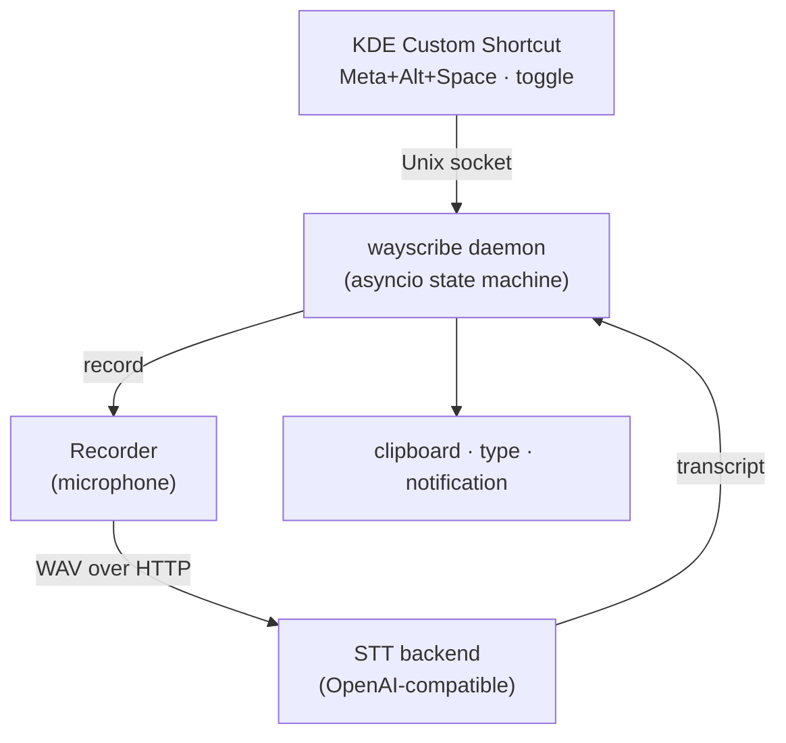

# wayscribe — hotkey voice-to-text for KDE Plasma Wayland

Press a global hotkey, speak, press it again — your words land in the clipboard,
optionally typed straight into the focused window, always with a KDE
notification preview. Headless: no GUI windows, just a background daemon and a
hotkey.

**Targeted at KDE Plasma on Wayland**: input/output is Wayland-native
(`wl-copy`, `ydotool`/`wtype`, `notify-send`, KDE D-Bus). Transcription runs in a
**separate local backend** that wayscribe only talks to over plain HTTP — any
OpenAI-compatible speech-to-text server works, on whatever hardware you have. The
reference setup runs Whisper V3 Turbo on an **AMD Ryzen AI NPU**, but that is
just one option.

> **Install, configure, troubleshoot → [SETUP.md](SETUP.md).**
> Transcription backend → **[BACKEND.md](BACKEND.md)**.
> Building from source, packaging, hacking on the code → **[DEVELOPMENT.md](DEVELOPMENT.md)**.

## How it works


```mermaid
flowchart TD
    T["KDE Custom Shortcut<br/>Meta+Alt+Space · toggle"]
    T -->|Unix socket| Daemon["wayscribe daemon<br/>(asyncio state machine)"]

    Daemon -->|record| Mic["Recorder<br/>(microphone)"]
    Mic -->|WAV over HTTP| STT["STT backend<br/>(OpenAI-compatible)"]
    STT -->|transcript| Daemon

    Daemon --> Out["clipboard · type · notification"]
```

1. The hotkey runs a thin client (`wayscribe toggle`) that sends one command to
   the long-lived **daemon** over a Unix socket — so the response is instant.
2. First toggle starts recording the mic; second toggle stops and POSTs the WAV
   to the **transcription backend** (any OpenAI-compatible STT).
3. The transcript fans out to your configured outputs: clipboard (`wl-copy`),
   keystroke injection (`ydotool`; `wtype` on wlroots), and a KDE notification.

The daemon holds a small state machine (`IDLE → RECORDING → TRANSCRIBING →
IDLE`). Safety rails: a max-duration watchdog auto-stops a forgotten recording,
and an opt-in silence detector can stop recording for you after you stop
talking.

## Usage

Press the hotkey, speak, press it again. The transcript goes to your clipboard
and a notification shows a preview. Paste with `Ctrl+V`. With `auto_type` on, it
types itself into whatever window has focus — no paste needed.

| Command | What it does |
| --- | --- |
| `wayscribe toggle` | Start recording if idle; stop and transcribe if recording. |
| `wayscribe status` | Print the daemon state + backend reachability as JSON. |
| `wayscribe doctor` | Diagnose daemon, backend, output tools, and config. |
| `wayscribe cancel` | Discard the current recording without transcribing. |
| `wayscribe stop` | Tell the daemon to exit cleanly. |
| `wayscribe oneshot --duration 5` | Record N seconds and print the transcript (no daemon). |
| `wayscribe lang` | Show the current transcription language. |
| `wayscribe lang next` | Cycle to the next language in `languages`. |
| `wayscribe lang ru` / `en` / `auto` | Set the language; `auto` lets Whisper detect it. |
| `wayscribe version` | Print the package version plus the git build hash. |
| `wayscribe log [-f] [-n N]` | Tail the daemon journal (systemd `--user` unit). |

Quick smoke test once everything is up:

```bash
wayscribe doctor              # checklist: daemon / backend / tools / config
wayscribe status              # {"ok": true, "state": "idle", "backend": "up", ...}
wayscribe oneshot --duration 3   # speak for 3 s, see the transcript printed
```

## License

See [LICENSE](LICENSE).
